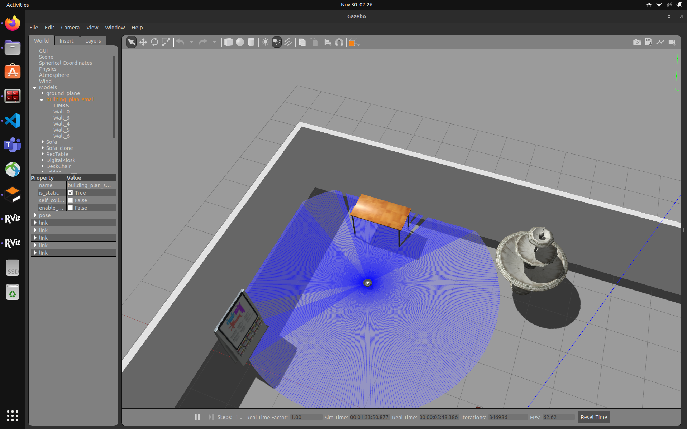
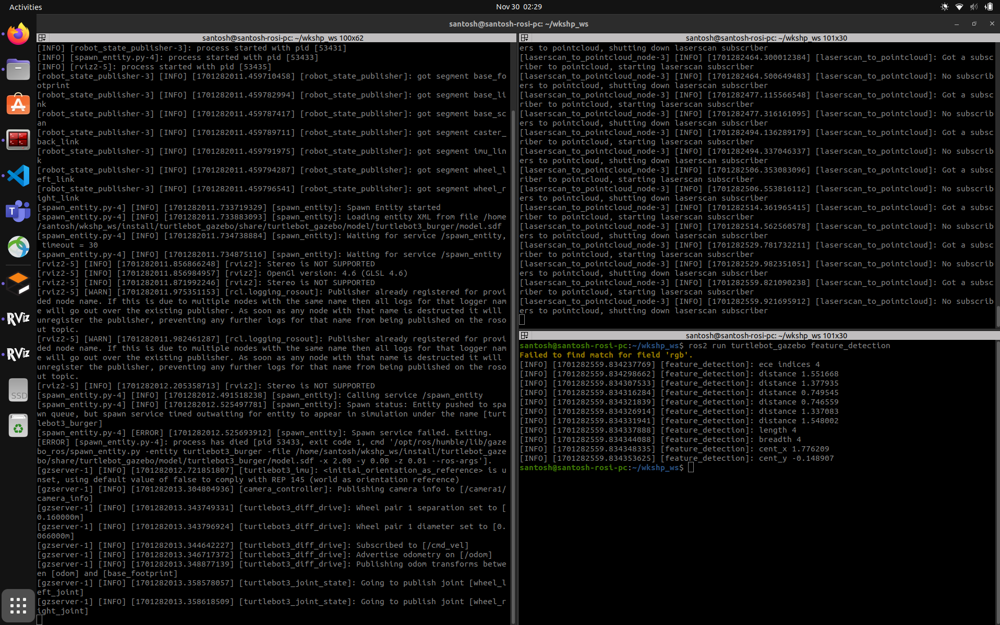
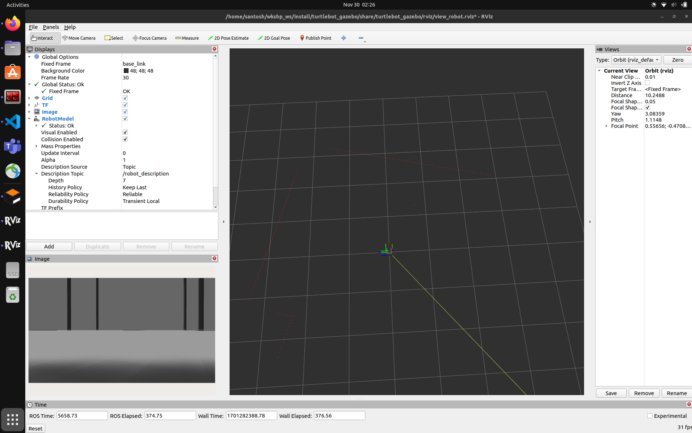

# bt_cpp_wkshp
This repository is for simulating the customized nav2 behavior tree

## Install dependencies
- To install dependencies for nav2_bt_wkshp package
```
  rosdep install --from-paths src/nav2_bt_wkshp -y --ignore-src
```

## Build and Execution
- To build the package
```
  colcon build --symlink-install
```

- To start simulation
```
  ros2 launch turtlebot_gazebo start_simulation.launch.py
```

- To start navigation
```
  ros2 launch turtlebot_nav2 start_navigation.launch.py
```

- To execute auto_docking tree with aruco marker publish the following
```
  ros2 topic pub /auto_docking nav2_msgs/msg/AutoDocking "{}" -r 0.1
```

- To test the feature detection function
```
  ros2 run turtlebot_gazebo feature_detection
```

## Demos






